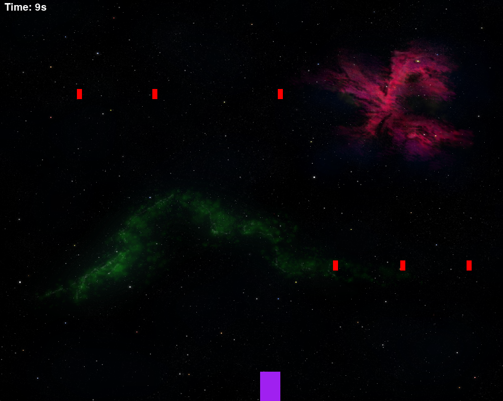

# Space Game

    
    
<em>A screenshot of the game.</em>

A simple 2D space game built with Python and Pygame.

The player controls a purple spaceship and must avoid falling red obstacles. The longer the player survives, the faster the obstacles appear.

The game ends when the player collides with an obstacle.

## Controls

- `A` / `Left Arrow` - Move left
- `D` / `Right Arrow` - Move right

## Purpose

This project was created as a learning exercise to practice basic game development concepts with Pygame.