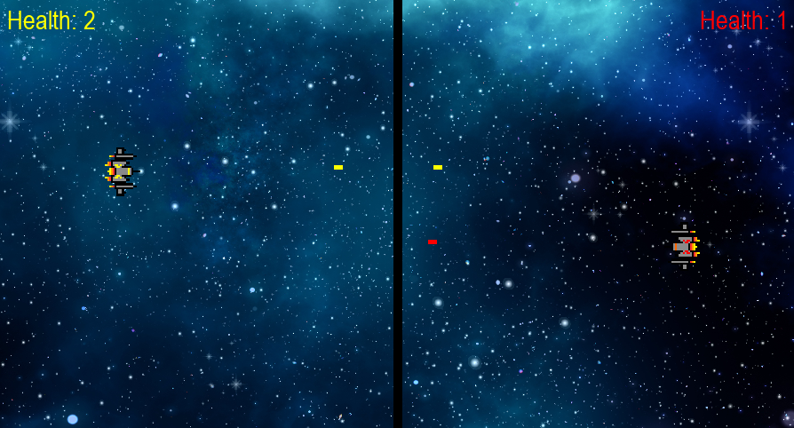

# Space Battle Ship

    
    
<em>A screenshot of the game.</em>

A simple 2D space battle game built with Python and Pygame.

Two players control spaceships on opposite sides of the screen and fight by shooting at each other. Each spaceship has 3 health points, and the first player to reduce their opponent's health to zero wins.

## Controls

* `W` / `A` / `S` / `D` - Move the yellow spaceship
* `Left Alt` - Shoot as Yellow
* `Arrow Keys` - Move the red spaceship
* `Right Alt` - Shoot as Red

## Purpose

This project was created as a learning exercise to practice basic game development concepts with Pygame, including player movement, collision detection, projectiles, health systems, sound effects, and game states.
