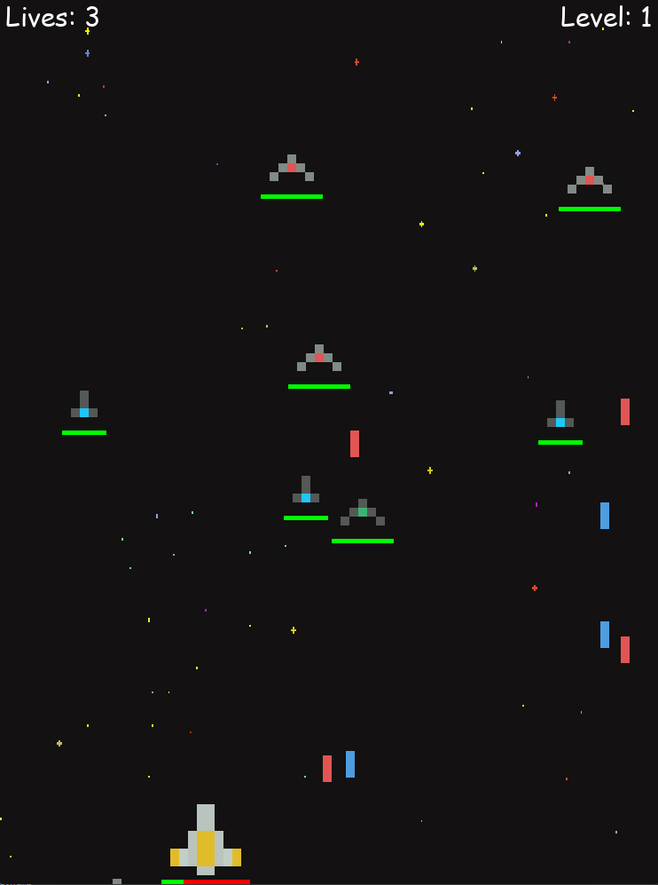

# Space Shooter

    
    
<em>A screenshot of the game.</em>

A simple 2D space shooter built with Python and Pygame.

The player controls a spaceship and fights waves of randomly spawning enemy ships. Enemies move down the screen and periodically shoot at the player, while the player can shoot back and destroy them. The player has multiple lives and a health system, and loses the game when all lives are gone.

## Controls

* `A` / `←` - Move left
* `D` / `→` - Move right
* `Space` - Shoot

## Purpose

This project was created as a learning exercise to practice basic game development concepts with Pygame, including object-oriented programming, class inheritance, player and enemy behavior, projectiles, collision detection, health and lives systems, random enemy spawning, and game states.
