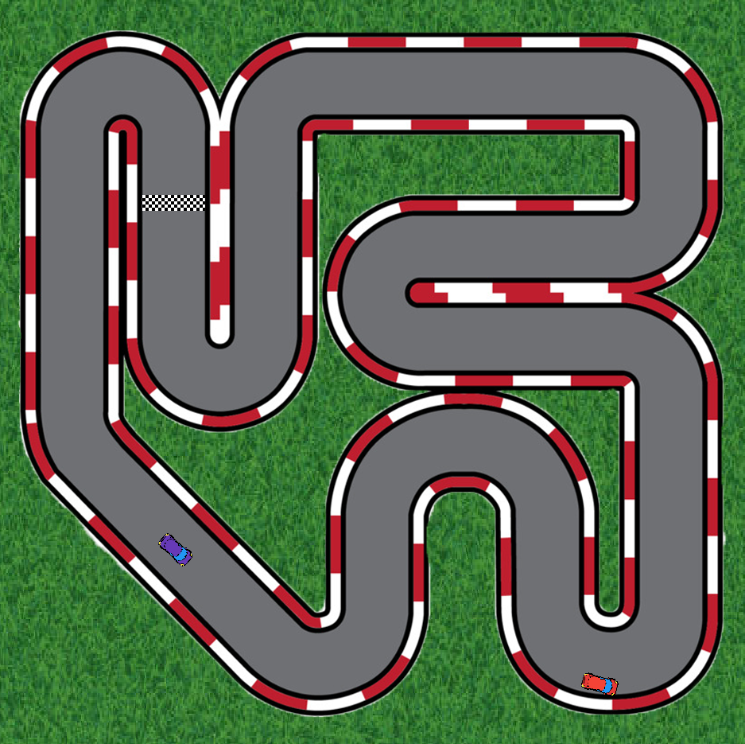
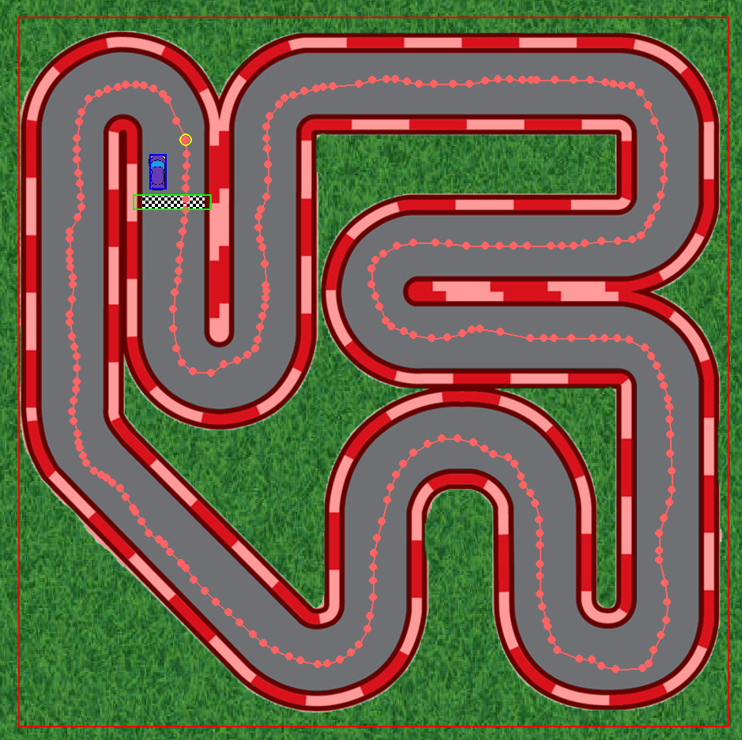

# Racing Game

<div align="center">

<p><em>A screenshot of the game.</em></p>
</div>

A simple 2D racing game built with Python and Pygame.

The player controls a racing car and competes against a computer-controlled car on a custom track. The computer car follows a predefined waypoint path, while both cars use mask-based collision detection for more accurate interactions with the track.

## Controls

### Player

* `W` - Accelerate / move forward
* `S` - Reverse
* `A` - Turn left
* `D` - Turn right

### Development Mode

<div align="center">

<p><em>Development mode showing the computer car's waypoint path and collision debugging.</em></p>
</div>

* `Left Mouse Button` - Add a waypoint
* `S` - Save the path
* `C` - Clear the path
* `R` - Reset the computer car

Enable development mode by setting `DEV_MODE = True` in `main.py`.

## Features

* Computer-controlled opponent using waypoint navigation
* Look-ahead path following for smoother racing
* Custom waypoint path creation and JSON saving/loading
* Mask-based collision detection
* Player vs. computer race and winner detection

## Computer Car

The computer-controlled car follows a racing line stored in `assets/computer_path.json`.

Each frame, it finds the nearest waypoint and targets a point further along the path using a look-ahead value. This allows the car to anticipate upcoming turns instead of simply moving toward the next waypoint.

The look-ahead distance can be adjusted in `ComputerCar.follow_path()`:

```python
look_ahead = 2
```

## Development Mode

Development mode provides a simple way to create and debug the computer's racing path.

Left-click on the track to add waypoints. The path can then be saved to:

```text
assets/computer_path.json
```

The saved path is automatically loaded when the game starts.

## Purpose

This project was created as a learning exercise to practice game development with Pygame, particularly object-oriented programming, collision detection, waypoint navigation, computer-controlled behavior, file handling, and game states.
