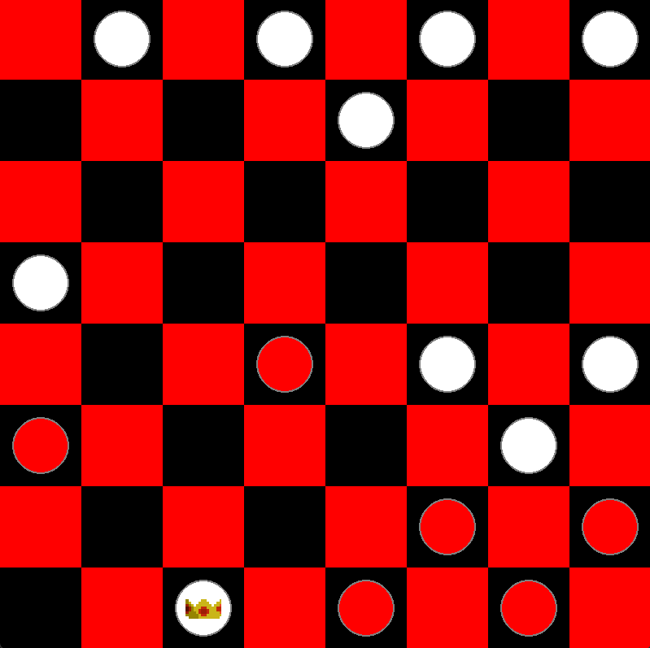

# Checkers

<div align="center">

<p><em>A screenshot of the game.</em></p>
</div>

A simple 2D checkers game built with Python and Pygame.

The player controls the red pieces and competes against a computer-controlled opponent playing white. The computer uses the minimax algorithm to evaluate future board positions and choose its moves.

## Controls

### Player

* `Left Mouse Button` - Select a piece / choose a destination square

## Features

* Full checkers rule set, including forced kings and multi-jump captures
* Computer-controlled opponent using the minimax algorithm
* Board evaluation based on piece count and king value
* Sound effects for moves, captures, kings, and game end
* Background music
* Win detection and end-game screen

## Computer Opponent

The computer plays as white and chooses its moves using minimax search over the board state, implemented in `minimax/algorithm.py`.

Each turn, the algorithm recursively simulates possible moves for both sides up to a fixed depth and picks the move that leads to the best evaluated position. The search depth can be adjusted in `main.py`:

```python
value, new_board = minimax(game.get_board(), 3, WHITE, game)
```

The board is evaluated in `Board.evaluate()`, based on the difference in remaining pieces and kings between white and red:

```python
def evaluate(self):
    return ((self.white_left - self.red_left) + ((self.white_kings * 0.5) - (self.red_kings * 0.5)))
```

## Purpose

This project was created as a learning exercise to practice game development with Pygame, particularly object-oriented programming, game state management, recursive algorithms, and simple game AI using minimax.