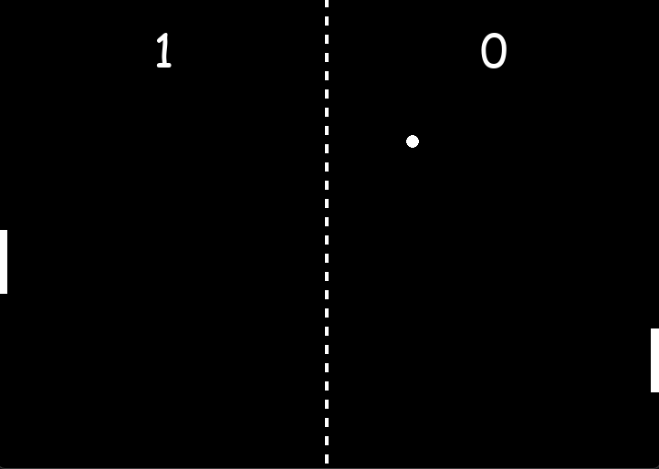

# Pong

<em>A screenshot of the game.</em>

A simple 2D Pong game built with Python and Pygame.

The game is a two-player version of Pong where each player controls a paddle and tries to prevent the ball from reaching their side of the screen.

## Controls

### Player 1 (Left)

* `W` - Move paddle up
* `S` - Move paddle down

### Player 2 (Right)

* `Up Arrow` - Move paddle up
* `Down Arrow` - Move paddle down

## Features

* Two-player Pong gameplay

* Paddle and ball collision detection

* Score tracking and ball reset after scoring

## Scoring

Players earn a point when the ball passes their opponent's paddle and leaves the opposite side of the screen.

After a point is scored, the ball is reset to the center of the screen and the game continues.

## Purpose

This project was created as a learning exercise to practice game development with Pygame, particularly object-oriented programming, collision detection, game loops, keyboard input, score tracking, and basic game state management.
