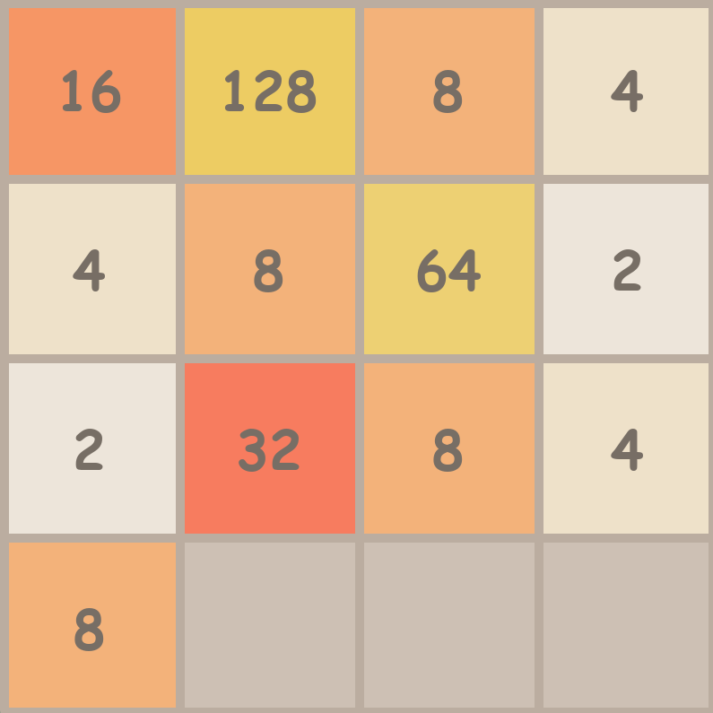

# 2048

<em>A screenshot of the game.</em>

A simple 2048 puzzle game built with Python and Pygame.

The player moves numbered tiles around a 4×4 grid, combining matching tiles to create higher values. The goal is to reach the 2048 tile before the board becomes full.

## Controls

* `W` - Move tiles up
* `A` - Move tiles left
* `S` - Move tiles down
* `D` - Move tiles right

## Features

* Tile movement and merging
* Game-over detection

## Purpose

This project was created as a learning exercise to practice game development with Pygame, particularly game loops, keyboard input, grid-based movement, tile merging, rendering, and game state management.
