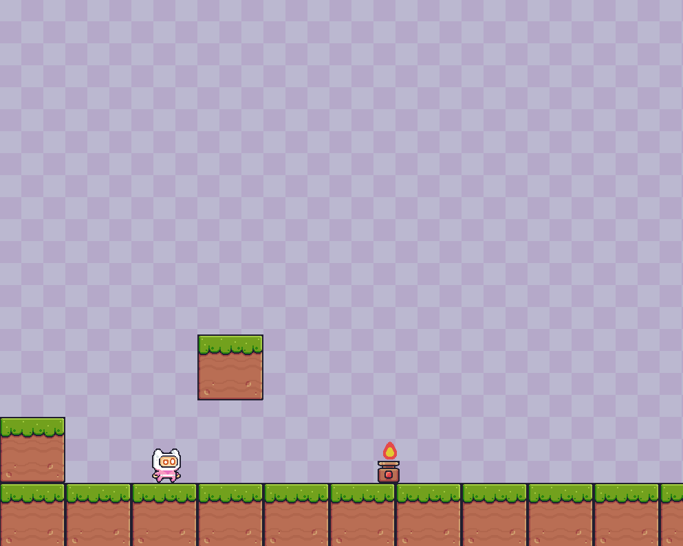
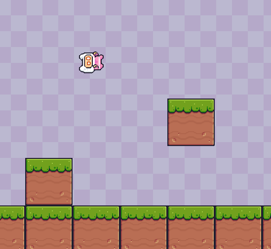

# Platformer

<em>A screenshot of the game.</em>

A simple 2D platformer built with Python and Pygame.

The player controls a character through a platform-based level, using movement and double jumps to navigate the environment while avoiding hazards.

## Controls

* `A` - Move left

* `D` - Move right

* `Space` - Jump

## Features

* Player movement and double jumping

* Animated character

* Platform and hazard collisions

* Scrolling camera

## Screenshots

<em>Using the double jump to navigate between platforms.</em>

<em>Encountering a fire hazard.</em>

<em>Player hit animation.</em>

## Purpose

This project was created as a learning exercise to practice game development with Pygame, particularly player movement, gravity, jumping, sprite animation, collision detection, camera scrolling, and game loops.